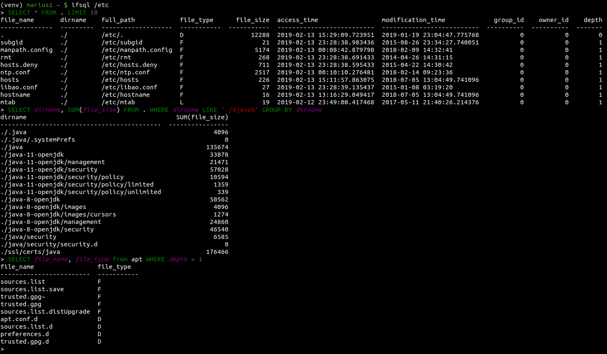

# ifsql

`ifsql` is an interactive command line tool for Linux that allows analysing the structure of a directory tree using SQL calls.



# Synopsis
```
usage: ifsql [-h] [--version] [-v] [-vv] [directory]

Analyzing directory structure with sql calls

positional arguments:
  directory            directory to analyse

optional arguments:
  -h, --help           show this help message and exit
  --version            show program's version number and exit
  -v, --verbose        set loglevel to INFO
  -vv, --very-verbose  set loglevel to DEBUG
```
If no directory is passed as an argument, current directory is used instead. Warning: as of now the code is stll rather poorly optimized so traversing complex, nested directories with thousands of files will take some time.

# Description

`ifsql` accepts as an input standard SQL queries using SQLite dialect. Instead of table names you use either `.` in order to operate on current directory or a path like `this/is/my/subdirectory` to limit the query to the content of given filesystem location.

There are following columns available to query:

| column name | description|
| ------------| -----------|
|file_name |Name of file or directory found.|
|dirname|Relative directory path. To obtain full relative path you can use SQLite concatenation syntaxt `SELECT dirname \|\| file_name FROM .`
|full_path|Absolute filesystem path.|
|file_type|An one-letter file-type symbol. A table of possible values is described below.
|file_size|File size in bytes.|
|access_time|Time of the last access.|
|modification_time|Time of the last modification.|
|creation_time|Time of file creation.|
|owner_id|Identificator of file owner.|
|group_id|Identificator of file group owner.|
|depth|Depth in the file tree. Current directory, `.` is the only one with the depth 0. All files and directories inside it have depth 1. Each subdirectory within the path increases depth by 1. In other words, to analyse only direct descendants of a current directory use `SELECT * FROM . WHERE depth = 1`

`file_type` column can have one of following values:

| value | file_type |
|-------|---------|
|D|Directory|
|F|File|
|B|Block device|
|C|Character device|
|N|Named pipe|
|L|Link|
|S|Socket|

For example, todetermine total size of all files recursively, you can use `SELECT SUM(*) FROM . WHERE file_type = 'F'`.

If instead of current directory `.` a subpath is used as a "table" to query from, the value of depth is decreased accordingly:
```
(venv) mariusz /tmp/TEST $ tree
.
└── SUBDIR1
    └── SUBDIR2
        └── FILE

2 directories, 1 file
(venv) mariusz /tmp/TEST $ ifsql
> SELECT file_name, depth FROM . WHERE file_name = 'FILE'
file_name      depth
-----------  -------
FILE               3
> SELECT file_name, depth FROM SUBDIR1 WHERE file_name = 'FILE'
file_name      depth
-----------  -------
FILE               2
> SELECT file_name, depth FROM SUBDIR1/SUBDIR2 WHERE file_name = 'FILE'
file_name      depth
-----------  -------
FILE               1
```


# Tests

To run tests:

```
python setup.py test
```


# Note

This project has been set up using PyScaffold 2.5.8. For details and usage
information on PyScaffold see http://pyscaffold.readthedocs.org/.


