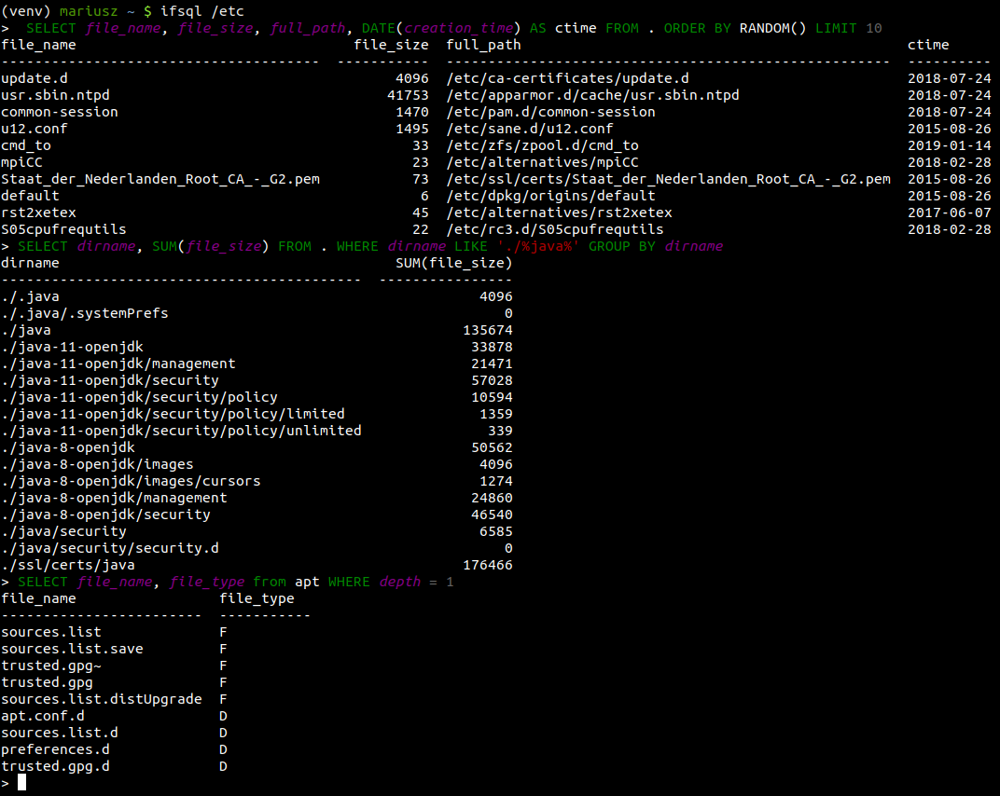

# Tests

To run tests:

```
python setup.py test
```


# Note

This project has been set up using PyScaffold 2.5.8. For details and usage
information on PyScaffold see http://pyscaffold.readthedocs.org/.


