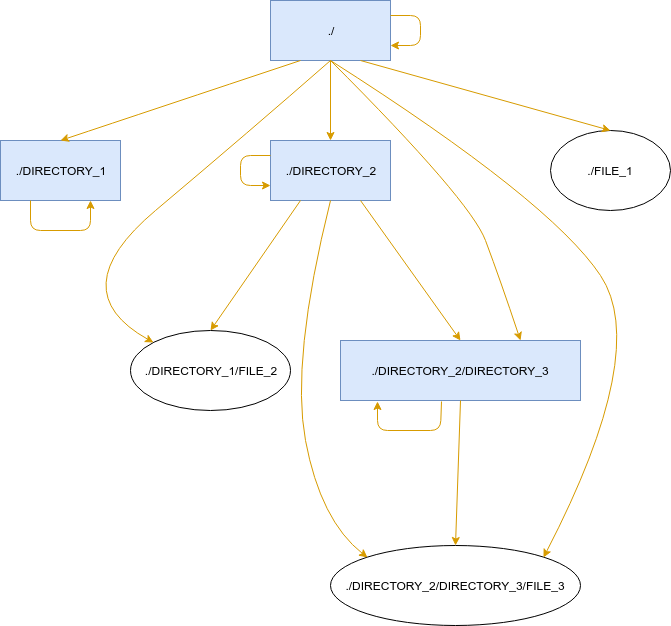

# SQL data model

To put it simply, `ifsql` works by creating in-memory SQLite database that is then populated with file metadata obtained from traversing the tree with `os.walk`. Management of this database is delegated to sqlalchemy library in order to avoid excesive use of raw queries.

To represent directory tree structure using RDBMS a pattern called [Closure Table](http://technobytz.com/closure_table_store_hierarchical_data.html) is used. Basically, there are two tables in the memory: `files` and `relations`. Each row of `files` table contains detailed information about a single file - its name, size, owner and so on. `relations` table is used to model the hierarchy. For every directory there are rows mapping relations between it and every of its descendants, including a relation to itself. For example, given following directory tree:

```
$ tree
.
├── DIRECTORY_1
│   └── FILE_2
├── DIRECTORY_2
│   └── DIRECTORY_3
│       └── FILE_3
└── FILE_1
```

We obtain following model:



Every arrow in this chart represents a single relation row. Besides the pair ancestor_id/descendant_id it also contain a depth value, which makes queries limited to a certain directoryy tree depth possible.

Both tables and database utilities can be found in [ifsql/database.py](../ifsql/database.py).

For more information about this technique can be found in a book *[SQL Antipatterns](https://pragprog.com/book/bksqla/sql-antipatterns)* by Bill Karwin.

# Parsing queries

Now that we have the model loaded into memory, we want to make SQL calls. Let's say we want to call `SELECT file_name, file_size FROM subdirectory`. To make this work we must find out what `file_id` does row representing `subdirectory` have. This is easy, since during the tree traversal all ids are stored in a cache, mapping subdirectory paths into ids from `files` table. Assuming that the value of this `file_id` is equal to 4, we need to replace `subdirectory` table name with a following join:

```sql
SELECT f.file_name, f.file_size
FROM files AS f
JOIN relations AS r ON f.file_id = r.descendant_id
WHERE r.ancestor_id = 4;
```

To do so, a parser written using [lark-parser](https://github.com/lark-parser/lark) library is used. This parser can be found in [ifsql/parser.py](../ifsql/parser.py) based on [SQLite BNF grammar](https://www.sqlite.org/docsrc/doc/trunk/art/syntax/all-bnf.html). Parser constructs a `sqlalchemy.sql.select` object from a string query. This object is passed down to `Database` class using `query` methods which transforms it as described above.


